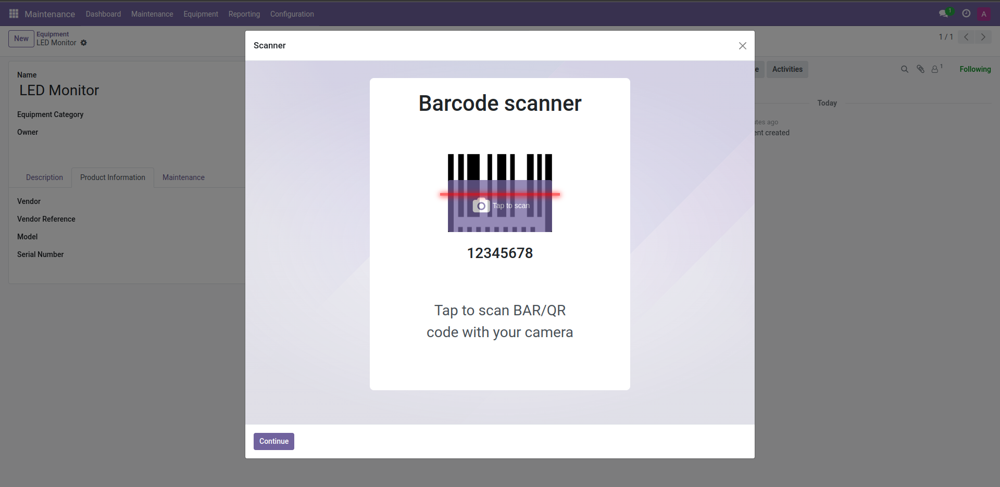
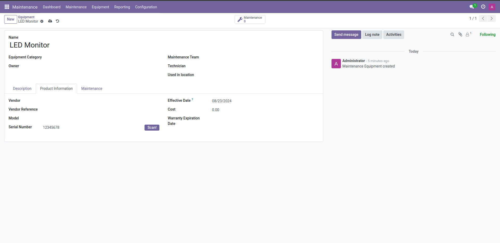

# Rdo Scanner View

Hello. I would like to introduce you to my new model. This module creates an easy way of adding custom functionality to any button. Simply add few lines of code add it will open a wizard that can scan any QR code or BAR code using just your webcam!

#### How to use

1. Lets say we are in app Maintenance under Equipment. There is a field Serail Number (or 'serial_no', if we look into the field definition in debug mode). Next to it, I added a simple button. I will show more on it later. On clicking, it will open the Scanner Wizard.


2. When we click the button 'Scan!', a wizard will pop up. User can then just click on the purple part of the barcode (wich is just a button) to start scanning.


3. Browser will start the camera and user can scan the BAR code or QR code. When he does, window automatically closes and value shows up under the barcode scanner.



4. To save it, user can just click Continue in the bottom left corner. This automatically saves it to the field user specified earlier.



#### How to add the 'Scan!' button

First, we have to add our button. We can define it, for example, using an xpath expression. Here is a code snippet that adds it one into Maintenance Equipment view.

1. Inherit model and add other required fields

```ruby
    <record id="rdo_equipment_scanner.equipment_form_inherit" model="ir.ui.view">
        <field name="name">maintenance.equipment.form.inherit</field>
        <field name="model">maintenance.equipment</field>
        <field name="inherit_id" ref="maintenance.hr_equipment_view_form"/>
        <field name="arch" type="xml">
        </field>
        </record>
```

2. Add xpath expression to find the correct element

```ruby
    <record id="rdo_equipment_scanner.equipment_form_inherit" model="ir.ui.view">
        <field name="name">maintenance.equipment.form.inherit</field>
        <field name="model">maintenance.equipment</field>
        <field name="inherit_id" ref="maintenance.hr_equipment_view_form"/>
        <field name="arch" type="xml">

            <xpath expr="//field[@name='serial_no']" position="replace">
            </xpath>

        </field>
    </record>
```

3. Add the insides. In my case, I'm replacing the whole field, so I must put back everything

```ruby
    <record id="rdo_equipment_scanner.equipment_form_inherit" model="ir.ui.view">
        <field name="name">maintenance.equipment.form.inherit</field>
        <field name="model">maintenance.equipment</field>
        <field name="inherit_id" ref="maintenance.hr_equipment_view_form"/>
        <field name="arch" type="xml">

            <xpath expr="//field[@name='serial_no']" position="replace">

                <label for="serial_no"/>
                <div class="o_row">
                    <field name="serial_no" nolabel="1" class="oe_inline" style="width: 170%;"/>
                    <button name="%(rdo_scanner_view.action_scanner_wizard_view)d"
                            type="action"
                            context="{'default_res_model': 'maintenance.equipment',
                                      'default_res_id': active_id,
                                      'default_res_field': 'serial_no'}"
                            class="btn btn-primary">
                        Scan!
                    </button>
                </div>
        
            </xpath>

        </field>
    </record>
```

Now notice the button element. You can just copy the first 2 attributes. They specify what the button should trigger. The interesting part is the context attribute. You have to define the keys:

* default_res_model - the model where the field is located
* default_res_id - the id of the record where the field is located
* default_res_field - the name of the field where the value should be saved

You should allways use variable active_id with key default_res_id. This will ensure that it allways saves to the correct record. The other 2 should be allways be string. See picture above.

Every file to run this for the first time is included in the module. Just install it and you are ready to go!

**rimedo s.r.o., by *Šimon Dovičovič***
